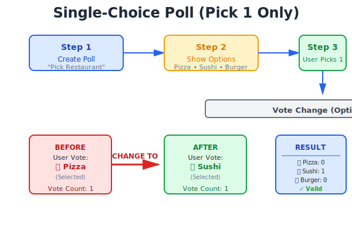
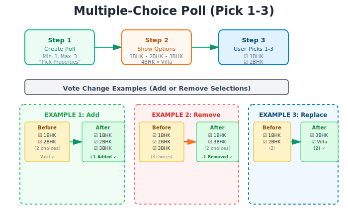

# WhatsApp MCP Automation

> **7 powerful WhatsApp tools for Claude, Cursor, and Windsurf, with features missing from [lharries/whatsapp-mcp](https://github.com/lharries/whatsapp-mcp)**

This is a **companion MCP tool package** that runs *alongside* `lharries/whatsapp-mcp`. It adds features that lharries doesn't support.

---

## What's in lharries/whatsapp-mcp vs This Repo

| Feature | lharries/whatsapp-mcp | This Repo |
|---------|:---:|:---:|
| Search contacts | ✅ | ✅ included |
| List chats | ✅ | ✅ included |
| Read messages | ✅ | ✅ included |
| Send messages | ✅ | ✅ included |
| Send media/files | ✅ | ✅ included |
| Download media | ✅ | ✅ included |
| **Poll voting** (single and multiple-choice) | ❌ | ✅ |
| **Animated reactions** (confetti, fireworks) | ⚠️ Partial | ✅ Enhanced |
| **Sticker manager** (2026 packs) | ❌ | ✅ |
| **Status creation** (with effects, scheduling) | ❌ | ✅ |
| **Event planner** (RSVP tracking) | ❌ | ✅ |
| **Live location** (real-time sharing) | ⚠️ Basic | ✅ Enhanced |
| **Group mentions** (@all, @role, @specific) | ❌ | ✅ |
| No Go install needed | ❌ | ✅ |
| Pre-compiled Windows bridge | ❌ | ✅ |

---

## Quick Install (Windows)

> No coding needed. Just follow the steps below.

### Before You Start

You need two free programs installed. Click each link, download, and run the installer:

1. **Node.js** - [Download from nodejs.org](https://nodejs.org) - click the big green "LTS" button
2. **Python uv** - Open Start Menu, search for "cmd", open it, paste this and press Enter:
   ```
   winget install --id=astral-sh.uv -e
   ```
   Then close the terminal window.

---

### Step 1 - Download this repo

Click the green **Code** button at the top of this page, then click **Download ZIP**.

Unzip it anywhere you like (for example: `C:\WhatsApp-Claude\`).

---

### Step 2 - Download the WhatsApp bridge

The bridge is what connects Claude to your WhatsApp account. It runs in the background.

[](https://github.com/priyasogani8-star/whatsapp-mcp-automation/releases/latest/download/whatsapp-bridge-windows-x64.exe)

Save `whatsapp-bridge-windows-x64.exe` into the same folder where you unzipped this repo.

---

### Step 3 - Run the setup

Open the folder where you unzipped everything. Double-click **`setup.bat`**.

It will install the required packages automatically. When it finishes, you will see a success message.

---

### Step 4 - Start the bridge and scan the QR code

Double-click **`whatsapp-bridge-windows-x64.exe`**.

A QR code will appear in the window. Open WhatsApp on your phone:

- iPhone: Settings > Linked Devices > Link a Device
- Android: Menu (three dots) > Linked Devices > Link a Device

Scan the QR code. The window will show "Connected" and you can minimise it. You only need to scan once. After that it reconnects automatically.

---

### Step 5 - Connect to Claude

Open Claude Desktop. Go to **Settings > Developer > Edit Config**.

Add the following inside the `mcpServers` section. Replace `C:\WhatsApp-Claude` with your actual folder path:

```json
{
  "mcpServers": {
    "whatsapp": {
      "command": "node",
      "args": ["C:\\WhatsApp-Claude\\whatsapp-mcp-automation-main\\combined-server.js"]
    }
  }
}
```

Save the file and restart Claude.

---

### Step 6 - Done ✅

In Claude, type: *"What WhatsApp tools do you have?"*

Claude will list all 30 available tools. You are ready to go.

---

## Connect to Other AI Apps

### Cursor IDE

Press `Ctrl+Shift+P`, search for "Open User Settings JSON", and add:

```json
{
  "cursor.mcp.servers": {
    "whatsapp": {
      "command": "node",
      "args": ["C:\\WhatsApp-Claude\\whatsapp-mcp-automation-main\\combined-server.js"]
    }
  }
}
```

Restart Cursor.

### Windsurf

Go to Settings > MCP Servers > Add Server and fill in:

- Command: `node`
- Args: `C:\WhatsApp-Claude\whatsapp-mcp-automation-main\combined-server.js`

---

## The 18 Extra Tools

### 🗳️ Polls

> Like creating a poll on Instagram, but for WhatsApp

Create a single-choice poll (pick one answer) or a multiple-choice poll (pick several). Votes can be changed. You can close a poll when you are done.

**Single-choice** (pick exactly one):



**Multiple-choice** (pick several):



Tools: `create_poll` `vote_poll` `change_vote` `get_poll_results` `list_polls` `close_poll`

---

### 😍 Animated Reactions

> React to a message with confetti, fireworks, sparkles, or hearts

Effect types: `confetti` `fireworks` `sparkles` `hearts` `emoji` `effect`

Tools: `add_reaction` `get_message_reactions`

---

### 🎨 Stickers

> Send stickers from packs (includes a 2026 New Year pack built in)

Tools: `send_sticker` `get_sticker_packs`

---

### 📸 Status Updates

> Post text, image, video, gif, or animated status updates with visibility controls

Visibility options: `everyone` `contacts only` `close friends`

Tools: `create_status`

---

### 🎉 Events

> Create a group event and track RSVPs, like Google Calendar inside WhatsApp

RSVP options: `accepted ✅` `declined ❌` `maybe 🤷` `pending ⏳`

Tools: `create_event` `rsvp_event` `get_event_stats`

---

### 📍 Live Location

> Share your real-time location in a chat for 5 to 60 minutes

Tools: `share_location` `stop_location_share`

---

### 📢 Group Mentions

> Send a message that notifies specific people in a group

Mention types: `@all` (everyone) `@role` (a named group) `@specific` (named individuals) `@admin`

Tools: `send_mention` `create_group_role`

---

## How It Works

```
Your WhatsApp Phone
       |
whatsapp-bridge-windows-x64.exe   (runs in background, handles the WhatsApp connection)
       |
combined-server.js                (joins the two tool sets together, 30 tools total)
       |
   Claude / Cursor / Windsurf
```

This repo bundles two things together:

1. ✅ The WhatsApp connection layer from [lharries/whatsapp-mcp](https://github.com/lharries/whatsapp-mcp) (MIT license) for reading and sending messages
2. ✅ The extra automation tools in this repo for polls, reactions, events, and more

---

## Troubleshooting

**❓ The QR code window closed before I could scan it**

Double-click `whatsapp-bridge-windows-x64.exe` again. A new QR code will appear.

**❓ Claude says it cannot find the WhatsApp tools**

Check that the path in your Claude config exactly matches where you put the folder. Use double backslashes in Windows paths (for example `C:\\Users\\You\\whatsapp\\combined-server.js`).

**❓ The bridge says "connection lost"**

This is normal if your computer was asleep. Double-click the bridge exe again to reconnect. You will not need to scan the QR code again after the first time.

**❓ setup.bat says Node.js is not installed**

Download and install it from [nodejs.org](https://nodejs.org), then double-click setup.bat again.

---

## Privacy and Security 🔒

- ✅ All your messages are stored on your own computer only, in a local database
- ✅ Nothing is sent to any external server (other than the AI app you are using)
- ✅ The bridge connects directly to WhatsApp using the official multi-device API
- ✅ No credentials or phone numbers are stored in this repo

---

## Legal Disclaimer

This project is for personal use only. It is not affiliated with, endorsed by, or sponsored by WhatsApp, Meta, or their parent companies.

---

## Credits

- WhatsApp connection layer by [lharries/whatsapp-mcp](https://github.com/lharries/whatsapp-mcp) (MIT License)
- Extra automation tools by [priyasogani8-star](https://github.com/priyasogani8-star) (MIT License)

---

## Support & Donate

If you appreciate this project and want to support its ongoing development, here are a few ways you can do so:

- **Donate via UPI**: priyasogani@ybl
- **Star**: If you find this repository useful, please give it a star on GitHub!
- **Spread the Word**: Share it with your friends and colleagues!

Thank you for your support!
